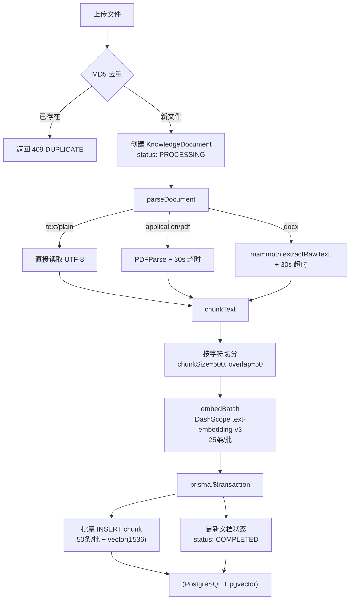
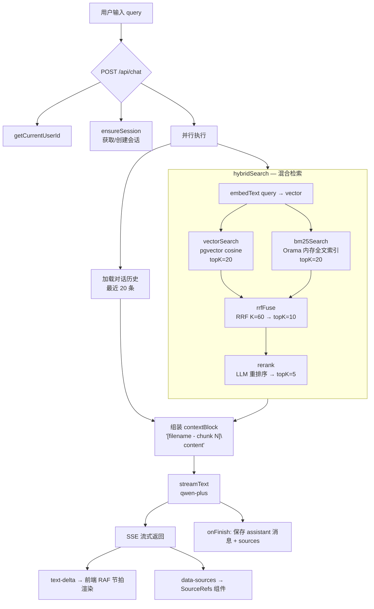
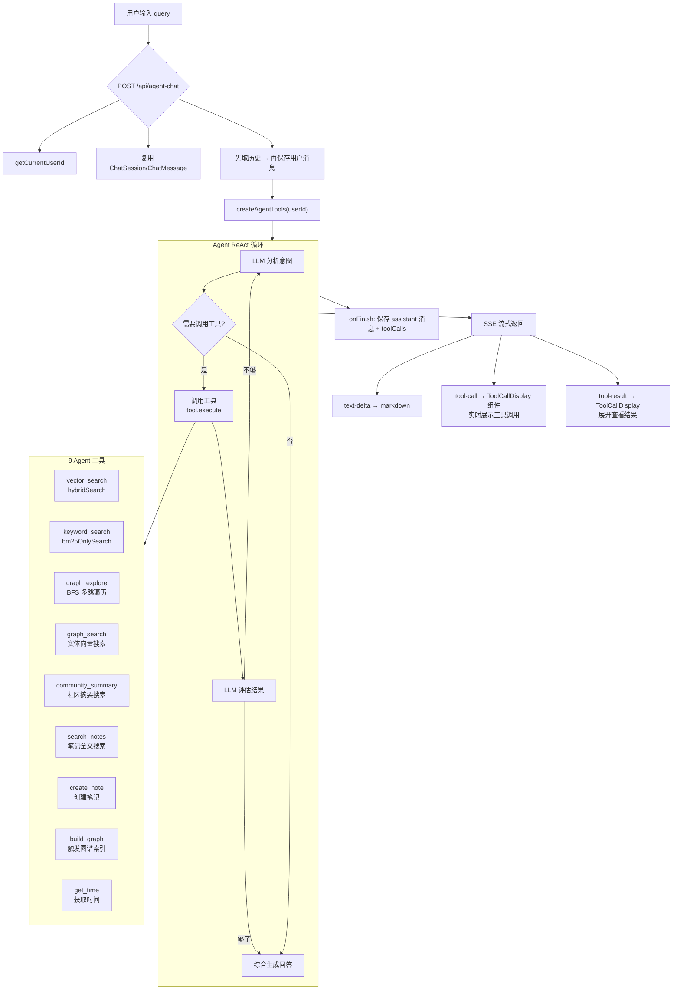
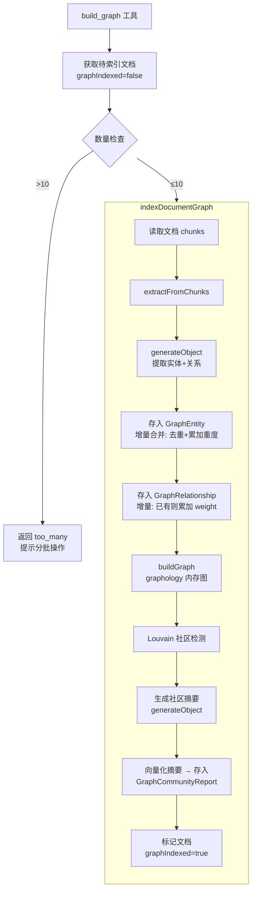
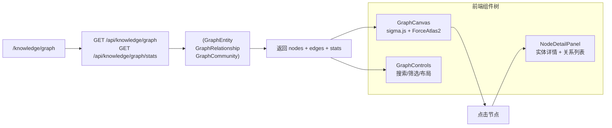
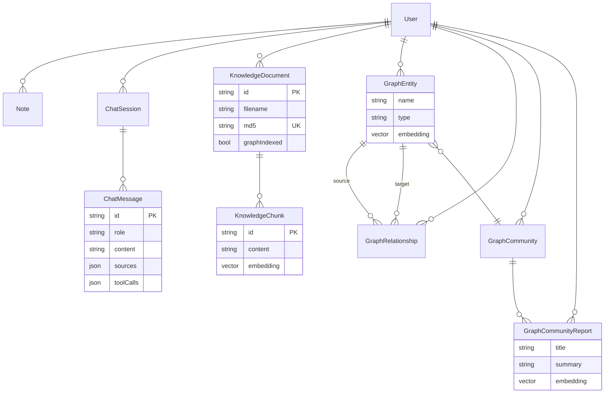

# RAG NoteBook 流程图

## 1. 文档入库流程

```mermaid
flowchart TD
    A["上传文件"] --> B{"MD5 去重"}
    B -->|"已存在"| C["返回 409 DUPLICATE"]
    B -->|"新文件"| D["创建 KnowledgeDocument\nstatus: PROCESSING"]
    D --> E["parseDocument"]
    E -->|"text/plain"| F["直接读取 UTF-8"]
    E -->|"application/pdf"| G["PDFParse + 30s 超时"]
    E -->|"docx"| H["mammoth.extractRawText + 30s 超时"]
    F --> I["chunkText"]
    G --> I
    H --> I
    I --> J["按字符切分\nchunkSize=500, overlap=50"]
    J --> K["embedBatch\nDashScope text-embedding-v3\n25条/批"]
    K --> L["prisma.$transaction"]
    L --> M["批量 INSERT chunk\n50条/批 + vector(1536)"]
    L --> N["更新文档状态\nstatus: COMPLETED"]
    M --> O["(PostgreSQL + pgvector)"]
    N --> O
```

## 2. 普通 RAG 对话流程

```mermaid
flowchart TD
    A["用户输入 query"] --> B{"POST /api/chat"}
    B --> C["getCurrentUserId"]
    B --> D["ensureSession\n获取/创建会话"]
    B --> E["并行执行"]
    E --> F["加载对话历史\n最近 20 条"]
    E --> G["hybridSearch"]

    subgraph G ["hybridSearch — 混合检索"]
        direction TB
        H["embedText query → vector"] --> I["vectorSearch\npgvector cosine\ntopK=20"]
        H --> J["bm25Search\nOrama 内存全文索引\ntopK=20"]
        I --> K["rrfFuse\nRRF K=60 → topK=10"]
        J --> K
        K --> L["rerank\nLLM 重排序 → topK=5"]
    end

    G --> M["组装 contextBlock\n'[filename - chunk N]\\ncontent'"]
    F --> M
    M --> N["streamText\nqwen-plus"]
    N --> O["SSE 流式返回"]
    O --> P["text-delta → 前端 RAF 节拍渲染"]
    O --> Q["data-sources → SourceRefs 组件"]
    N --> R["onFinish: 保存 assistant 消息 + sources"]
```

## 3. Agent GraphRAG 流程（新模式）

```mermaid
flowchart TD
    A["用户输入 query"] --> B{"POST /api/agent-chat"}
    B --> C["getCurrentUserId"]
    B --> D["复用 ChatSession/ChatMessage"]
    B --> E["先取历史 → 再保存用户消息"]
    E --> F["createAgentTools(userId)"] --> G["streamText\nqwen-plus + maxSteps:5"]

    subgraph G ["Agent ReAct 循环"]
        direction TB
        H["LLM 分析意图"] --> I{"需要调用工具?"}
        I -->|"是"| J["调用工具\ntool.execute"]
        J --> K["LLM 评估结果"]
        K -->|"不够"| H
        K -->|"够了"| L["综合生成回答"]
        I -->|"否"| L
    end

    G --> M["SSE 流式返回"]
    M --> N["text-delta → markdown"]
    M --> O["tool-call → ToolCallDisplay 组件\n实时展示工具调用"]
    M --> P["tool-result → ToolCallDisplay\n展开查看结果"]
    G --> Q["onFinish: 保存 assistant 消息 + toolCalls"]

    subgraph Tools ["9 Agent 工具"]
        T1["vector_search\nhybridSearch"]
        T2["keyword_search\nbm25OnlySearch"]
        T3["graph_explore\nBFS 多跳遍历"]
        T4["graph_search\n实体向量搜索"]
        T5["community_summary\n社区摘要搜索"]
        T6["search_notes\n笔记全文搜索"]
        T7["create_note\n创建笔记"]
        T8["build_graph\n触发图谱索引"]
        T9["get_time\n获取时间"]
    end

    J --> Tools
```

## 4. 图谱索引流程（Agent 触发）

```mermaid
flowchart TD
    A["build_graph 工具"] --> B["获取待索引文档\ngraphIndexed=false"]
    B --> C{"数量检查"}
    C -->|">10"| D["返回 too_many\n提示分批操作"]
    C -->|"≤10"| E["indexDocumentGraph\n异步执行"]

    subgraph E ["indexDocumentGraph"]
        direction TB
        F["读取文档 chunks"] --> G["extractFromChunks"]
        G --> H["generateObject\n提取实体+关系"]
        H --> I["存入 GraphEntity\n增量合并: 去重+累加重度"]
        I --> J["存入 GraphRelationship\n增量: 已有则累加 weight"]
        J --> K["buildGraph\ngraphology 内存图"]
        K --> L["Louvain 社区检测"]
        L --> M["生成社区摘要\ngenerateObject"]
        M --> N["向量化摘要 → 存入\nGraphCommunityReport"]
        N --> O["标记文档\ngraphIndexed=true"]
    end
```

## 5. 图谱可视化架构

```mermaid
flowchart LR
    A["/knowledge/graph"] --> B["GET /api/knowledge/graph\nGET /api/knowledge/graph/stats"]
    B --> C["(GraphEntity\nGraphRelationship\nGraphCommunity)"]
    C --> D["返回 nodes + edges + stats"]
    D --> E["GraphCanvas\nsigma.js + ForceAtlas2"]
    D --> F["GraphControls\n搜索/筛选/布局"]
    E --> G["点击节点"]
    G --> H["NodeDetailPanel\n实体详情 + 关系列表"]

    subgraph I["前端组件树"]
        E
        F
        H
    end
```

## 6. 数据模型关系

```mermaid
erDiagram
    User ||--o{ Note : ""
    User ||--o{ ChatSession : ""
    User ||--o{ KnowledgeDocument : ""
    User ||--o{ GraphEntity : ""
    User ||--o{ GraphRelationship : ""
    User ||--o{ GraphCommunity : ""
    User ||--o{ GraphCommunityReport : ""

    KnowledgeDocument ||--o{ KnowledgeChunk : ""
    KnowledgeDocument {
        string id PK
        string filename
        string md5 UK
        bool graphIndexed
    }

    KnowledgeChunk {
        string id PK
        string content
        vector embedding
    }

    ChatSession ||--o{ ChatMessage : ""
    ChatMessage {
        string id PK
        string role
        string content
        json sources
        json toolCalls
    }

    GraphEntity ||--o{ GraphRelationship : "source"
    GraphEntity ||--o{ GraphRelationship : "target"
    GraphEntity }o--|| GraphCommunity : ""
    GraphEntity {
        string name
        string type
        vector embedding
    }

    GraphCommunity ||--o{ GraphCommunityReport : ""
    GraphCommunityReport {
        string title
        string summary
        vector embedding
    }
```
